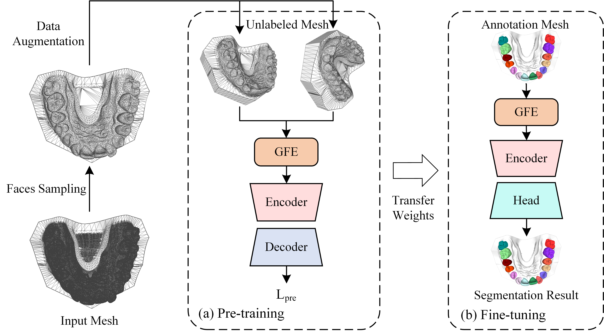
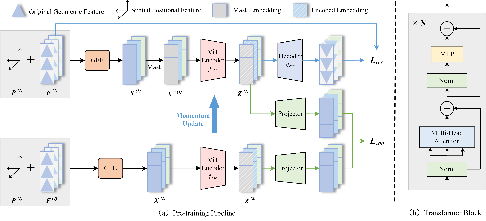

# Geometry-Guided Multi-View Contrastive Masked Autoencoder for Low-Supervision 3D Tooth Segmentation

ToothGeoCMAE is a self-supervised framework designed to learn discriminative geometric representations from unlabeled 3D dental meshes. By integrating Masked Autoencoding (MAE) with Multi-view Contrastive Learning, the model achieves state-of-the-art performance in 3D tooth segmentation using only 30% of labeled data.



## Abstract
*Accurate 3D tooth segmentation from intraoral scans is essential for computer-aided digital dentistry. Existing deep learning methods rely heavily on dense annotations and struggle to learn discriminative representations for similar teeth and fine boundaries. Pure masked autoencoder approaches lack multi-view consistency constraints and fail to model geometry-position coupling explicitly. We present a unified self-supervised framework named ToothGeoCMAE for low-supervision 3D tooth segmentation. The method uses a dual-branch architecture to integrate masked reconstruction and geometry-preserving multi-view contrastive learning. We design a cross-attention-based Geometry-guided Face Embedding module to model geometry-position interactions for enhanced boundary and detail representation. Experiments on Teeth3DS and 3D-IOSSeg datasets show that with only 30\% annotations, our method outperforms state-of-the-art self-supervised baselines and achieves comparable performance to fully supervised methods. This work provides an effective solution to reduce annotation dependence in digital dental visual computing.*

### Requirements
- NVIDIA RTX 3090 GPU
- Python 3.8
- PyTorch 2.1.0 + CUDA 12.1
- CUDA Toolkit 12.2
- see requirements.txt for additional dependencies
To install the required dependencies, run the following command:
```bash
pip install -r requirements.txt
```
Compile Chamfer Distance:
```bash
cd chamfer_dist
python setup.py install
```

### Data Preparing
The data used in this project is the Teeth3DS and 3D-IOSSeg dataset. Please organize the full datasets in the following structure:
```
data
    | train
        | ×××.obj
        | ×××.json
    | test
        | ×××.obj
        | ×××.json
    | finetune_120.txt / finetune_12.txt
    | finetune_360.txt / finetune_36.txt
    | finetune_480.txt / finetune_48.txt
    | finetune_840.txt / finetune_84.txt
```
Each .txt file defines the training subset indices for low-label fine-tuning experiments (10%, 30%, 100%).<br>
The Teeth3DS dataset (MICCAI 3DTeethSeg’22 Challenge) can be downloaded from https://osf.io/xctdy/. The 3D-IOSSeg dataset can be downloaded from https://reurl.cc/0vjLXY. For more information about the data, check out the link https://github.com/abenhamadou/3DTeethSeg_MICCAI_Challenges and https://github.com/MIVRC/Fast-TGCN.<br>
We provide sample files in the data directories.

### Pre-training
To train the encoder on unlabeled dental meshes to learn general geometric features, run the following command:
```bash
bash scripts/train_pretrain_Teeth3ds.sh
```
or <br>
```bash
bash scripts/train_pretrain_IOSSeg.sh
```
The training configuration (including learning rate, batch size, masking ratio, and network architecture settings) is fully specified in the shell script for reproducibility.


### Fine-tuning
Fine-tune the pre-trained encoder using different proportions of labeled training data (e.g., 10%, 30%, and 100%), as defined in the corresponding data split .txt files, and evaluate the performance on the test set. Please run the following command:
```bash
bash finetune.sh
```
The detailed experimental settings, including dataset split selection (10%, 30%, 100%), optimizer configuration, and training hyperparameters, are defined in the shell script.

### Citation
If you find our work useful in your research, please cite our upcoming paper once it is officially published.<br>
Paper Title: Geometry-Guided Multi-View Contrastive Masked Autoencoder for Low-Supervision 3D Tooth Segmentation <br>
Target Journal: The Visual Computer <br>
Once the paper is formally accepted and published, we will update the complete standard BibTeX citation information in a timely manner.
